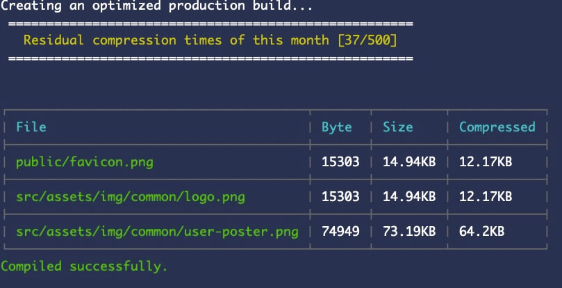

# img-compression-webpack-plugin

[](https://www.npmjs.com/package/img-compression-webpack-plugin)


<p align="center">
	<br>
	
	<br>
</p>


## Install

```bash
$ npm i img-compression-webpack-plugin -D
```

## API KEY
[Get API KEY](https://tinypng.com/developers)


## Usage

```js
// webpack.config.js

const ImgCompressionWebpackPlugin = require('img-compression-webpack-plugin');

module.exports = {
  plugins: [
    new ImgCompressionWebpackPlugin({ key: 'your api key' })
    // ...
  ]
};
```


## Questions & Suggestions

Please open an issue [here](https://github.com/xjh22222228/img-compression-webpack-plugin/issues).

## License

[MIT](LICENSE)
